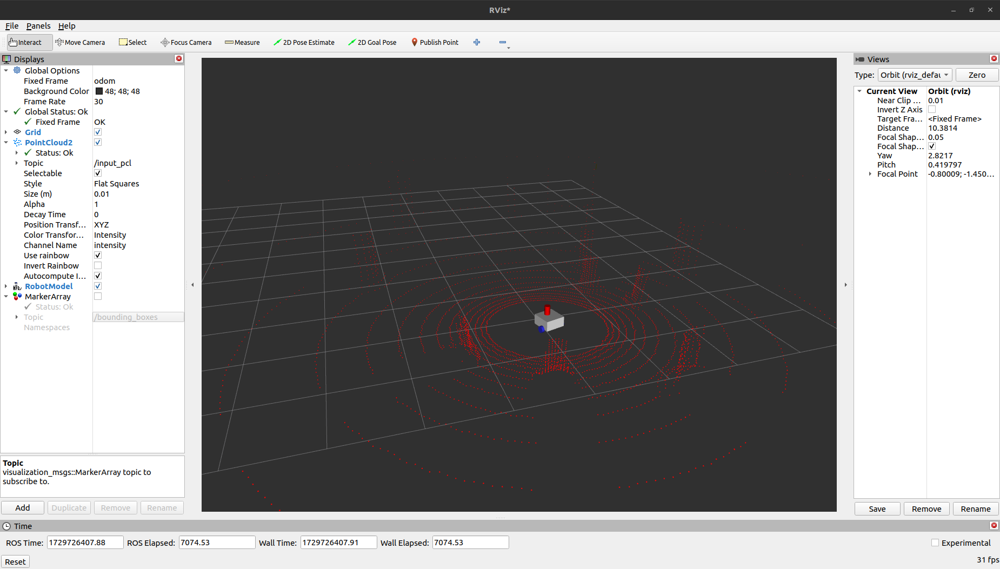
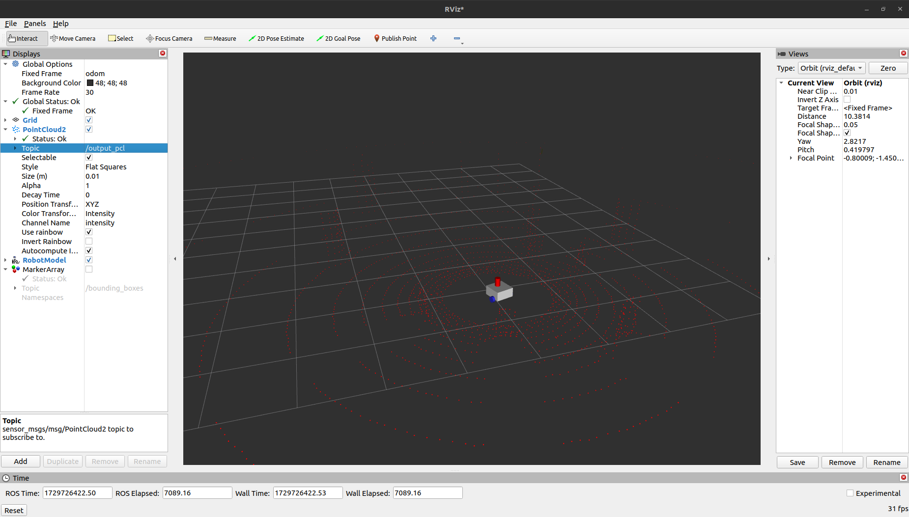
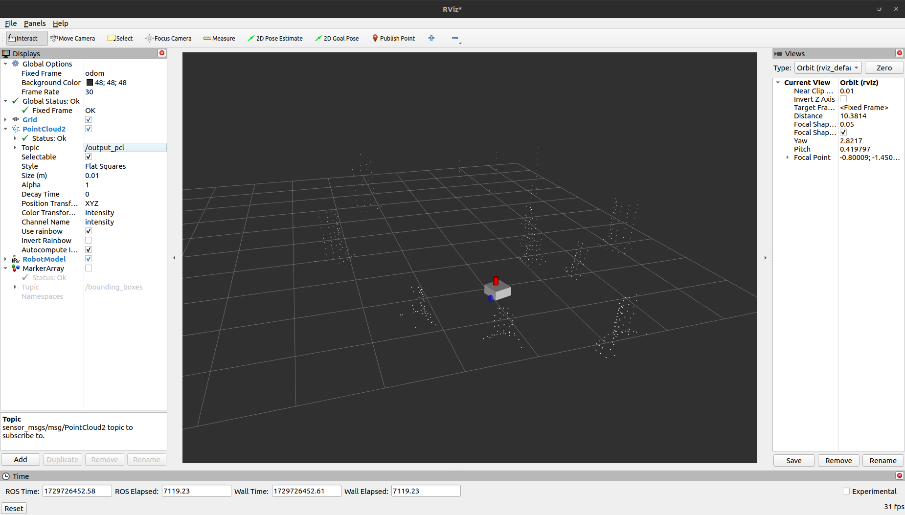
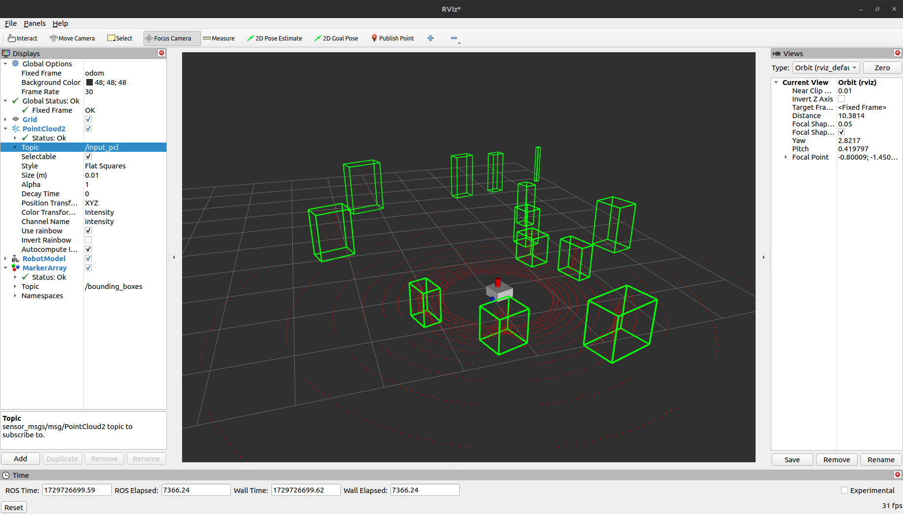

# LiDAR Detection Package for ROS2

The **LiDAR Detection Package** provides nodes for each steps of processing point cloud data in ROS2. This package has been tested with ROS2 Humble, but it is expected to work with ROS2 Foxy as well.

## Dependencies

To use this package, you will need to install the following dependencies:

- **PCL Conversion**: A package for converting point clouds.
- **PCL ROS**: The ROS interface for the Point Cloud Library.
- **PCL**: The Point Cloud Library itself.

Make sure to install these packages before running any nodes from the `lidar_detection` package.

## Nodes

You can run the following nodes using the command:

```bash
ros2 run lidar_detection <name_of_node>
```

### Node Descriptions

**Important**: This is not a cascade of nodes. As you go further down the list, each node performs all the actions of the previous ones, with an additional processing step implemented. This means each node builds upon the functionality of the prior node.

1. **preprocessor_node**
   - **Functionality**: Subscribes to `input_pointcloud` (sensor_msgs/PointCloud2) and applies filtering to the point cloud. Publishes the filtered point cloud to `output_pointcloud` (sensor_msgs/PointCloud2).
   - **Usage**: Useful for cleaning up point cloud data before further processing.

<p align="center">
  
  
</p>

2. **ground_removal_node**
   - **Functionality**: Subscribes to `input_pointcloud` (sensor_msgs/PointCloud2) and removes ground points from the point cloud. Publishes the filtered point cloud to `output_pointcloud` (sensor_msgs/PointCloud2).
   - **Usage**: Ideal for focusing on objects above the ground in the point cloud data.



3. **cluster_extraction_node**
   - **Functionality**: Subscribes to `input_pointcloud` (sensor_msgs/PointCloud2), removes ground points, and extracts clusters from the remaining data. Publishes the result to `output_pointcloud` (sensor_msgs/PointCloud2).
   - **Usage**: Helpful for identifying distinct objects within the point cloud.

4. **bounding_box_node**
   - **Functionality**: Subscribes to `input_pointcloud` (sensor_msgs/PointCloud2), removes ground points, extracts clusters, and publishes bounding boxes around each cluster in `bounding_boxes` (visualization_msgs/MarkerArray).
   - **Usage**: Provides visual markers for detected clusters, making it easier to visualize object detection in RViz.



## Installation

1. Clone the repository:
   ```bash
   cd <your_workspace>/src
   git clone <repository_url>
   ```

2. Build the package:
   ```bash
   cd <your_workspace>
   colcon build
   ```

3. Source your workspace:
   ```bash
   source install/setup.bash
   ```